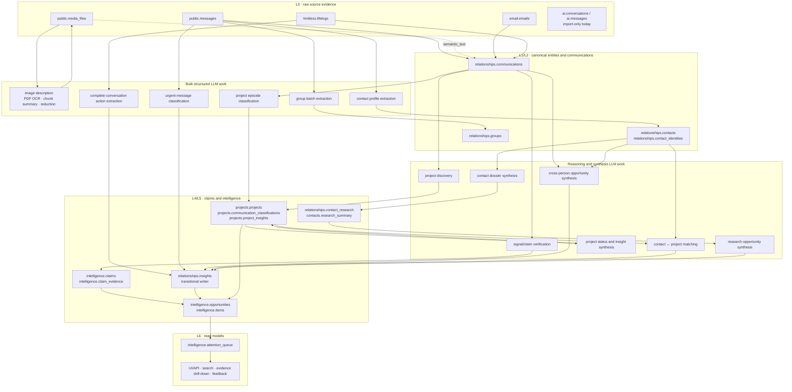
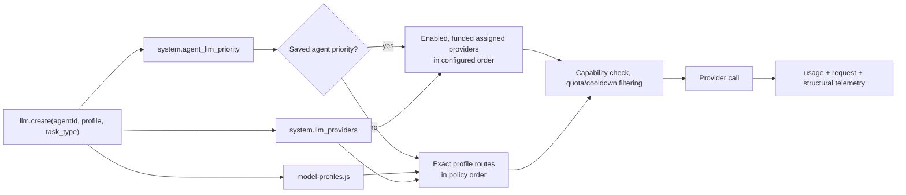
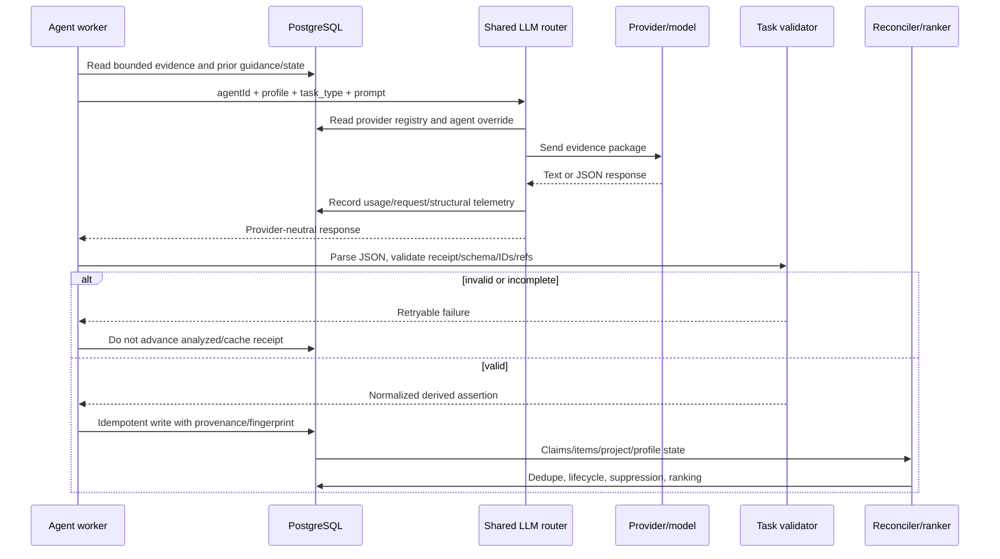

# LLM processing architecture

Status: current implementation reference. This document complements the
normative layer and lifecycle contracts in [README.md](README.md),
[DATA_LAYERS.md](DATA_LAYERS.md), and
[INTELLIGENCE_MODEL.md](INTELLIGENCE_MODEL.md). When this document and runtime
code disagree, treat the code as the executable truth and update this document
in the same change.

## Purpose and boundaries

SecondBrain uses deterministic code for ingestion, stable identity, canonical
communication IDs, deduplication, lifecycle transitions, and ranking. LLMs are
used only where semantic interpretation materially helps:

- faithful media description and document summarization;
- schema-bound extraction and classification at volume;
- multi-evidence relationship and project synthesis;
- verification of actor, subject, polarity, lifecycle, and evidence;
- public research and concise dossier synthesis.

An LLM response is never source evidence. It is a derived assertion. Before it
can influence the product it must be parsed, validated, linked to evidence, and
reconciled with prior state and user guidance.

## End-to-end data and LLM flow



## Runtime routing and precedence

Every shared-router call has an `agentId`, `profile`, `task_type`, and
`workflow_name`. The call path is:



The current profiles in
[`model-profiles.js`](../../packages/agents/shared/model-profiles.js) are:

| Profile | Default route | Intended work |
|---|---|---|
| `bulk_structured` | OpenAI `gpt-5.6-luna`, low effort | High-volume extraction, classification, and media semantics |
| `reasoning_synthesis` | OpenAI `gpt-5.6-terra`, high effort | Multi-evidence relationship/project synthesis and verification |
| `autonomous_tools` | Sol, then Claude Sonnet, then Groq | Rare tool-using loops; no active product call site currently |
| `frontier_manual` | Claude Fable, then Sol maximum effort | Explicit manual escalation; no active product call site currently |

Provider credentials, enabled state, credit state, and concrete provider/model
records live in `system.llm_providers`. The UI saves the per-agent ordered
override in `system.agent_llm_priority`. A saved override currently applies to
all profiles used by that agent; it is not profile-specific. Consequently, an
operator-selected Relationships provider can handle both bulk and synthesis
jobs. Profile reasoning effort is retained only when the chosen provider/model
matches the profile route. See [MODEL_ROUTING.md](MODEL_ROUTING.md) for the
normative policy and change gates.

## Active LLM job catalog

The prompt text is assembled at the linked source. The contract summaries below
document the evidence supplied, the instruction that materially controls the
model, and the required outcome.

| Agent | Task type | Profile | Input and batching | Outcome |
|---|---|---|---|---|
| WhatsApp | `media_image_description` | bulk | One image | Faithful plain-text description in `public.media_files.semantic_text` |
| WhatsApp | `media_pdf_ocr` | bulk + vision | Configured 1-8 rendered pages per call; default 4 | Ordered transcription/description, later reduced to semantic text |
| WhatsApp | `media_pdf_chunk_summary` | bulk | Extracted PDF text chunks | Fact-preserving partial summaries |
| WhatsApp | `media_pdf_summary_reduce` | bulk | Up to six ordered partial summaries | One deduplicated PDF semantic summary |
| Relationships | `relationship_contact_extract_json` | bulk | One contact; 20 recent messages, bounded document text, manual overrides | Contact profile fields |
| Relationships | `relationship_group_batch_extract_json` | bulk | Up to 8 complete group samples or 80,000 evidence characters | One acknowledged analysis per group |
| Relationships | `meeting_action_batch_extract_json` | bulk | Up to 25 complete Limitless conversations or 240,000 characters | Zero or more action items per acknowledged conversation |
| Relationships | `urgent_message_classify_json` | bulk | Up to 20 recent inbound messages | Urgency and reply-needed decision |
| Relationships | `cross_person_opportunity_synthesis_json` | synthesis | One cross-source digest | Up to five check-in/introduction/follow-up/project-match candidates |
| Relationships | `project_relationship_match_json` | synthesis | Up to 10 open projects and 50 important contacts | Up to three strong contact/project matches |
| Relationships | `research_opportunity_batch_synthesis_json` | synthesis | Up to 12 contacts or 30,000 characters | Explicit opportunity or `null` per contact |
| Projects | `project_discovery_json` | synthesis | Bounded canonical communication episodes plus existing project catalog | Up to 10 validated projects or continuations |
| Projects | `project_episode_classification_json` | bulk | Up to 80 communication episodes plus current projects | Positive matches; omitted items become durable no-match decisions |
| Projects | `project_status_synthesis_json` | synthesis | One project, canonical refs, open/resolved items, guidance and overrides | Project state, up to three insights, ambiguity/resolution proposals |
| Intelligence | `signal_claim_verification_json` | synthesis | One deterministic candidate signal cluster | Validated atomic claims and promote/no-promote decision |
| Research | provider-specific web search | direct OpenAI Responses API | One contact identity/context | Cited public research stored per provider |
| Research | `contact_research_synthesis` | synthesis | Successful provider summaries for one contact | Four-to-six sentence professional dossier |
| UI manual analysis | `manual_contact_extract_json` | bulk | One user-requested contact with WhatsApp/email samples and overrides | Proposed contact fields returned to UI; `my_role` is immediately persisted |

Two prompt functions are exported but have no active runtime caller:
`relationship_participant_extract_json` and
`relationship_insight_synthesis_json`. They remain documented as dormant code,
not as boxes in the active flow.

## Prompt contracts

### WhatsApp media

Source:
[`mediaAnalyzer.js`](../../packages/agents/whatsapp/src/lib/mediaAnalyzer.js).

The current image prompt is:

```text
Describe this WhatsApp image for semantic retrieval. Include visible objects,
setting, charts or documents, and accurately transcribe useful visible text.
Do not guess identities or hidden context. Use concise plain text.
```

PDF processing uses a map/reduce prompt family:

1. Scanned pages: transcribe in page order; preserve every readable name,
   organization, date, amount, table value, decision, action, and claim; describe
   diagrams; never infer missing text or identity.
2. Text chunks: preserve names, organizations, dates, amounts, decisions,
   actions, claims, and contradictions; add no facts.
3. Reduction: retain distinct facts, unresolved questions, risks, and actions;
   remove repetition only; add no facts.

The output is plain text because it becomes a content variant consumed by later
canonical communication and synthesis stages. The original file remains the
evidence.

### Relationship contact profile

Source:
[`analyzer.js`](../../packages/agents/relationships/services/analyzer.js).

Prompt skeleton:

```text
Role: analyze a WhatsApp contact from the account owner's perspective.
Evidence: provider identity, display name, message counts/dates, 20 recent
messages, bounded extracted document text, media-analysis note, and durable
manual overrides.

Critical instruction: describe who the contact is TO the account owner, not the
reverse. Treat user-confirmed overrides as ground truth. Mark bots, OTPs,
automated alerts, delivery/bank notifications, and spam as noise.

Return JSON:
{display_name, company, job_title, relationship_type, my_role,
 relationship_strength, summary, tags, is_noise}
```

The normalized result updates `relationships.contacts`. Raw messages and media
are not modified.

### Relationship group batch

Source:
[`analyzer.js`](../../packages/agents/relationships/services/analyzer.js).

Prompt skeleton:

```text
Role: analyze each WhatsApp group independently for a senior executive.
Evidence per group: exact group_id, name, total/my message counts, participation
percentage, participants, last-active date, and up to 50 messages containing an
exact canonical_ref, author, date, and bounded semantic text.

Return exactly one groups[] receipt per group_id:
{group_type, my_role, ai_summary, key_topics, communication_advice,
 notable_contacts, opportunities[{title, description, priority, evidence_refs}],
 is_noise}

Only specific opportunities are allowed. Every opportunity must cite an exact
canonical_ref from the same group. Community groups are checked for leads,
introductions, market intelligence, and events.
```

The receipt validator rejects omitted groups. Evidence validation removes any
opportunity reference not present in that group's input. Valid results update
`relationships.groups`; supported opportunities are also written to the legacy
relationship ledger and the first-class intelligence path.

### Limitless meeting actions

Source:
[`opportunities.js`](../../packages/agents/relationships/services/opportunities.js).

Prompt skeleton:

```text
Role: extract action items from complete meeting transcripts.
Evidence per conversation: lifelog_id, title, date, and the entire downloaded
transcript.

Extract only:
1. commitments made by You/Me;
2. decisions requiring follow-up;
3. direct requests for a response or decision;
4. discussed but unconfirmed follow-up meetings/calls/documents.

Return exactly one conversations[] receipt per lifelog_id, containing at most
four {title, description, priority, contact_name} items or an explicit [].
```

The model-provided name remains unresolved evidence and is never name-matched to
a canonical person. Explicit empty decisions receive a durable cache receipt;
positive results remain retryable until their insight is persisted.

### Urgent message classification

Source:
[`opportunities.js`](../../packages/agents/relationships/services/opportunities.js).

The prompt asks for `{chat_id, urgency, needs_response, reason}` per message.
High urgency requires a question, deadline, requested decision, expressed
problem, explicit urgency, or a strong-contact message with a clear reply
expectation. Casual, FYI, and one-sided updates must remain low/no-response.
Only medium/high messages requiring a reply become `action_needed` insights.

### Cross-person and contact/project opportunities

Source:
[`opportunities.js`](../../packages/agents/relationships/services/opportunities.js).

The cross-person prompt searches a recent cross-source digest for four explicit
patterns: check-in after difficulty, introduction between a stated need and
matching capability, follow-up on a mention, and a contact who can help a
project. It returns no more than five specific candidates and permits `[]`.
Synthesized names are kept unresolved rather than converted into contact IDs.

The project-match prompt compares open project outcomes with important contact
roles and research summaries. It returns at most three
`{project_id, contact_id, reason, suggested_opener, priority}` records, and only
when expertise or connections provide a concrete match.

### Research-driven opportunities

Source:
[`opportunities.js`](../../packages/agents/relationships/services/opportunities.js).

Prompt skeleton:

```text
Role: identify strong, timely outreach reasons from recent research; analyze
each contact independently and prefer signal quality over producing an item.
Evidence: contact_id, name, company, and bounded provider research.
Look for: product/funding/expansion news, role changes, achievements, or events.

Return exactly one contacts[] receipt per contact_id:
{contact_id, opportunity: null | {title, description, priority}}

Use null rather than generic networking advice.
```

Only an explicit `null` is cached as a negative decision. An incomplete object
remains retryable. Positive source references contain an input fingerprint so
the same evidence reconciles to the same item while changed evidence is eligible
for reconsideration.

### Project discovery

Source:
[`discoverer.js`](../../packages/agents/projects/services/discoverer.js).

The prompt receives bounded canonical episodes from email, Limitless, and
WhatsApp plus the existing project catalog. A project must have an intended
outcome, stakeholders, lifecycle, direct canonical evidence, a concrete
completion test, and an exact outcome-evidence quote. Broad themes, people,
channels, and interests are excluded. Existing projects require the exact
numeric ID; name similarity is insufficient. The validator rejects unsupported
references and unproven new projects.

Required project output:

```json
{
  "name": "Short outcome-bearing name",
  "existing_project_id": null,
  "description": "What is being delivered or decided",
  "status": "active|stalled|completed|unknown",
  "health": "on_track|at_risk|blocked|unknown",
  "priority": "high|medium|low",
  "tags": [],
  "keywords": [],
  "evidence_refs": ["exact canonical_ref"],
  "completion_test": "Observable completion condition",
  "outcome_evidence": {"ref": "exact canonical_ref", "quote": "exact span"}
}
```

### Project episode classification

Source:
[`classifier.js`](../../packages/agents/projects/services/classifier.js).

The prompt receives up to 80 bounded communication episodes and the active
project catalog. It is precision-first: `null` is correct unless evidence
clearly concerns delivery, a decision, or progress toward a listed outcome.
The response copies an exact batch receipt and contains only positive matches
above relevance `0.7`. Every omitted episode becomes an explicit, durable
no-match decision after the batch receipt validates.

```json
{
  "batch_id": "exact input receipt",
  "matches": [
    {"id": "source_id", "project_id": 42, "relevance": 0.84,
     "rationale": "Brief evidence-based reason"}
  ]
}
```

### Project status, insights, and ambiguity

Source:
[`analyzer.js`](../../packages/agents/projects/services/analyzer.js).

The prompt receives one project, newest-first communications with canonical
refs, manual overrides, durable guidance, resolved insights, open insights, and
pending ambiguities. It must name actual people, organizations, amounts, and
dates rather than use vague language. It returns:

- current `status`, `health`, `ai_summary`, and `next_action`;
- at most three material, evidence-backed insights;
- only persistent high-impact clarification questions;
- explicit resolutions backed by newer evidence and confidence of at least
  `0.8`;
- explicit ambiguity resolutions backed by a new canonical reference.

Omission never closes an existing item. Every insight/ambiguity reference must
be copied byte-for-byte from supplied canonical refs. Manual overrides protect
the corresponding project fields from model updates.

### Signal and claim verification

Source:
[`signal-clusterer.js`](../../packages/agents/intelligence/services/signal-clusterer.js).

Deterministic regex and clustering only nominate evidence for review; the prompt
explicitly says those matches are routing hints, not facts. The verifier must:

- distinguish speaker from subject;
- reject ownership inferred from quoted or forwarded text;
- handle negation and lifecycle correctly;
- copy exact evidence spans and refs;
- promote only a specific, actionable, currently active proposition supported
  by the supplied evidence.

It returns `promote`, presentation fields, and atomic claims containing claim
type, actor, subject, predicate, polarity, lifecycle, and exact evidence. Zero
claims with `promote=false` is a valid and preferred result when support is weak.

### Public research and dossier synthesis

Sources:
[`providers/openai.js`](../../packages/agents/research/providers/openai.js) and
[`research/index.js`](../../packages/agents/research/index.js).

The provider-specific OpenAI prompt uses web search for current professional
background, role/company, achievements, reputation, recent news, and public
presence. It requires reliable information, same-name disambiguation,
uncertainty language, source citations, and fewer than 300 words. This is the
only active LLM path that bypasses the shared router and calls the Responses API
directly.

The dossier prompt combines successful provider summaries and requests one
factual four-to-six sentence professional paragraph covering role, reputation,
news, and notable facts. Uncertainty must be attributed; invention is forbidden.
Provider results are stored in `relationships.contact_research`; the dossier is
stored as `relationships.contacts.research_summary`.

### Manual contact analysis

Source: [`server.js`](../../packages/ui/server.js).

The user-triggered prompt combines a contact's existing fields, up to 20
WhatsApp messages, five emails with bounded attachment text, and manual
overrides. It uses the same owner-relative perspective and noise taxonomy as the
scheduled contact extractor. The API returns proposed profile fields and the
list of locked override fields. This path does not silently overwrite all
returned fields; `my_role` is persisted by the route and the client controls the
rest of the edit workflow.

## Validation, receipts, and persistence



| Validation | Applied where | Failure behavior |
|---|---|---|
| JSON parsing and bounded retry | Relationship and project structured calls | Retry, then retain `analysis_error`/failed run |
| Exact batch receipt | Limitless actions, group analysis, project classification, research opportunities | Entire incomplete batch remains retryable |
| Allowed entity/project IDs | Project classification and matching | Unknown IDs are rejected or omitted |
| Exact evidence refs | Group opportunities, project discovery/status, signal claims | Unsupported refs/items are removed or rejected |
| Exact evidence quote | Project outcome evidence and signal claims | Candidate is not promoted without a supported span |
| Durable negative receipt | Project no-match, empty meeting actions, null research opportunity | Identical evidence is not repeatedly sent to an LLM |
| Positive persistence receipt | Insights, projects, claims, opportunities | Crash before persistence leaves work eligible for retry |
| Guidance/manual override precedence | Contact and project synthesis | Model cannot overwrite locked user-confirmed state |

## Representative outcomes

These examples are illustrative and contain no real user data.

### Media semantic content

```text
One-page vendor quotation from Example Systems dated 18 July 2026. Total quoted
amount: INR 420,000. The table lists implementation, training, and annual
support. A handwritten note says “confirm rollout date after finance approval.”
```

This text is stored beside, not instead of, the original media and can be used
as canonical communication content.

### Contact profile

```json
{
  "display_name": "Example Contact",
  "company": "Example Systems",
  "job_title": "Implementation Director",
  "relationship_type": "vendor",
  "my_role": "client",
  "relationship_strength": "moderate",
  "summary": "Example Contact leads the vendor implementation discussed with the account owner.",
  "tags": ["implementation", "operations"],
  "is_noise": false
}
```

### Group opportunity

```json
{
  "group_id": "example-group@g.us",
  "analysis": {
    "group_type": "community",
    "my_role": "occasional_contributor",
    "ai_summary": "An industry group used for introductions and event updates.",
    "key_topics": ["industry event", "supplier introductions"],
    "communication_advice": "Engage selectively when a concrete introduction can add value.",
    "notable_contacts": [],
    "opportunities": [{
      "title": "Offer supplier introduction",
      "description": "A member explicitly requested an introduction to a qualified supplier.",
      "priority": "medium",
      "evidence_refs": ["wa-message-example-123"]
    }],
    "is_noise": false
  }
}
```

### Project state

```json
{
  "status": "active",
  "health": "at_risk",
  "ai_summary": "Finance approval is still pending, while the vendor requires a rollout date.",
  "next_action": "Ask the finance owner to confirm approval timing, then send the vendor a rollout date.",
  "insights": [{
    "insight_type": "blocker",
    "content": "Finance approval is blocking rollout confirmation.",
    "priority": "high",
    "evidence_refs": ["canonical-email-example-77"],
    "evidence_occurred_at": "2026-07-18T09:30:00Z",
    "reopens_resolution": false
  }],
  "ambiguities": [],
  "resolutions": [],
  "resolved_ambiguities": []
}
```

### Verified claim and surfaced item

```json
{
  "claim": {
    "claim_type": "commitment",
    "actor_type": "self",
    "predicate": "send the approved rollout date to the vendor",
    "polarity": "positive",
    "lifecycle_state": "active",
    "evidence": [{
      "ref": "canonical-email-example-77",
      "quote": "I will send the confirmed rollout date once finance approves."
    }]
  },
  "item": {
    "item_type": "action",
    "status": "open",
    "title": "Confirm and send rollout date",
    "recommended_next_action": "Get finance approval timing and reply to the vendor.",
    "evidence_count": 1,
    "lifecycle_state": "active"
  }
}
```

The final attention score is deterministic and feedback-aware. The LLM supplies
evidence-backed semantic structure; it does not directly choose the queue rank.

## Deterministic jobs adjacent to LLM processing

Not every “intelligent” outcome is an LLM call. These paths are deliberately
deterministic:

- email and Limitless ingestion, including idempotent upserts and settle polling;
- exact source identity normalization, conflicts, redirects, and merges;
- canonical communication deduplication and participant linking;
- cold-relationship, awaiting-reply, and read-email-gap detection;
- communication recovery and media-content refresh;
- claim/item fingerprints, lifecycle reconciliation, suppressions, feedback,
  recurrence checks, and attention scoring;
- process supervision, leases, retry scheduling, and orphan reaping.

This separation keeps expensive model work focused on semantic ambiguity and
keeps identity, provenance, and lifecycle behavior reproducible.

## Keeping this document current

Any new or materially changed LLM task must update this file in the same change:

1. add or update the task catalog row;
2. document its prompt inputs, critical instructions, output contract, and
   permitted negative result;
3. show its persistence target and downstream consumer;
4. document batching, receipts, schema/evidence validation, and retry behavior;
5. update diagrams if a new data dependency or LLM stage is introduced;
6. satisfy the evaluation and model-change gates in
   [QUALITY_GATES.md](QUALITY_GATES.md) and [MODEL_ROUTING.md](MODEL_ROUTING.md).
