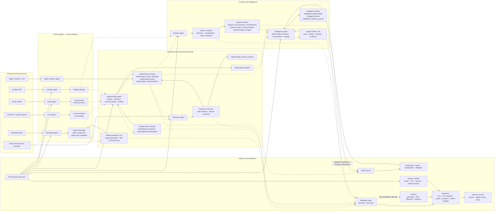
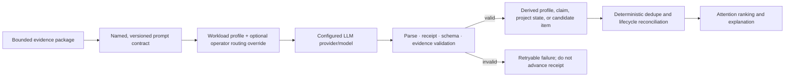

# SecondBrain architecture

Status: normative target contract with an explicit mapping to the transitional codebase. Physical table and service names may change; the layer boundaries and invariants must not.

## Product goal

SecondBrain should understand how people, organizations, groups, and projects relate to the account owner across communication channels, then surface a small, insightful set of opportunities, issues, decisions, risks, actions, and durable insights. It should correct routine data errors without requiring curation. It may ask a concise question only when a consequential ambiguity persists across communications and cannot be resolved from evidence.

## Canonical flow

```text
immutable source evidence
  -> normalized communication events and content variants
  -> canonical people, organizations, groups, projects and participant links
  -> evidence-backed claims plus user-guidance overlays
  -> reconciled intelligence items and relationship/project state
  -> ranked attention queue, search and explanations
  -> outcomes, contradictions and feedback feed reconciliation
```

The arrows are one-way dependencies. A higher layer may point to a lower layer, but it must not mutate the lower layer to make its analysis easier.

## Current system map

This diagram shows the current physical implementation. Solid arrows are writes;
dashed arrows are reads or derived-data dependencies. The detailed LLM jobs,
prompt contracts, validation rules, and example outcomes are documented in
[LLM_PROCESSING.md](LLM_PROCESSING.md).



`ai.conversations` and `ai.messages` are currently an import-only raw archive;
there is no active canonical or intelligence consumer for them. That gap is
shown deliberately rather than implying a pipeline that does not exist.

### Runtime component inventory

| Component | Responsibility | Primary state |
|---|---|---|
| WhatsApp agent | Capture messages/chat metadata, download media, run leased semantic media analysis | `public.messages`, `public.chat_metadata`, `public.media_files` |
| Email agent | Incremental IMAP synchronization for configured Gmail accounts | `email.accounts`, `email.emails` |
| Limitless agent | Settle-aware, idempotent lifelog ingestion; no semantic actions | `limitless.lifelogs` |
| AI importers | Idempotent ChatGPT/Gemini export archive | `ai.conversations`, `ai.messages`, `ai.sync_log` |
| Apple Contacts agent | Import exact provider identities and provisional/canonical contact records | `relationships.contacts`, `relationships.contact_identities` |
| Relationships agent | Canonical communications, contact/group state, relationship facts and transitional insights | `relationships.*` |
| Research agent | Multi-provider contact research and dossier synthesis | `relationships.contact_research`, `contacts.research_summary` |
| Projects agent | Outcome discovery, episode classification, project state and project insights | `projects.*` |
| Intelligence agent | Claims, evidence, guidance, reconciliation, opportunity lifecycle and ranking | `intelligence.*` |
| UI/API server | Read APIs, user commands, configuration and single-owner worker supervision | Read models plus `system.agent_runtime_state` |
| Telemetry library/buffer | Run/request/progress/quality events with local spill fallback | `telemetry.*`, local NDJSON spill |
| Collector | Spill replay, ETA/work-efficiency computation and retention | `telemetry.work_efficiency` and related tables |
| Sampler | Host power, CPU, memory and local-model session samples | `telemetry.system_samples`, `telemetry.model_sessions` |
| Observe service | Operational dashboard, manual quality review and alert evaluation | Reads/writes `telemetry.*` |

## Where LLMs are allowed



LLMs do not establish source identity, rewrite raw evidence, or directly decide
the final attention order. Their outputs are derived assertions that must pass
task-specific validation and retain evidence provenance.

## Responsibilities

| Boundary | Owns | Must not own |
|---|---|---|
| Source connectors | Faithful, idempotent capture of provider records and media | Person merging, project judgment, opportunity ranking |
| Canonicalization | Stable event IDs, identities, participants, redirects and conflicts | Rewriting provider payloads or semantic conclusions |
| Semantic extraction | Versioned facts and claims with evidence, polarity, time and confidence | Presentation state or source mutation |
| Reconciliation | Contradiction, corroboration, closure, expiry and item lifecycle | A second copy of source communications |
| Ranking | Personalized attention score and explanation | Inventing claims to fill a queue |
| API/UI | Commands and read models | Hidden business rules or an independent ledger |

## Current physical mapping

The current code is transitional:

- Raw sources are primarily `email.emails`, `public.messages`, `public.media_files`, `limitless.lifelogs`, and `ai.*`.
- `relationships.contacts` remains the canonical person/profile record for now; `relationships.contact_identities` is the matching authority. `relationships.identity_conflicts` and `relationships.contact_merge_redirects` now preserve conflicts and canonical redirects.
- `relationships.communications` now enforces canonical `(source, source_id)` uniqueness for the current single-account deployment. Explicit source-account identity and typed participant-link tables remain transitional gaps.
- `projects.project_communications` should become a link/read model over canonical communications rather than copied message rows.
- The existing `intelligence.communication_events` table represents scheduled real-world events mentioned in communications. It is not the canonical communication-event layer; rename or clearly namespace it before introducing that layer.
- `relationships.contact_facts` is evidence-backed relationship memory. `intelligence.guidance_facts` and `intelligence.clarification_questions` now provide the general append-only overlay and question lifecycle described in [GUIDANCE_AND_SELF_CORRECTION.md](GUIDANCE_AND_SELF_CORRECTION.md).
- `intelligence.claims`, `claim_evidence`, and `item_claims` establish the evidence-backed claim layer. Their first extractor is intentionally transitional because it still derives claims from keyword signals rather than complete communication episodes.
- `intelligence.opportunities` is now the write-compatible typed item ledger and `intelligence.items` its read view. `relationships.insights` and `projects.project_insights` remain competing legacy writers to migrate.

## Required design shape

- Core domain services do not import UI or connector code.
- Connectors depend on source adapters and write ports.
- Canonicalization depends on identity/event repositories, not detector implementations.
- Extractors emit validated domain records; they do not directly decide presentation ranking.
- Reconcilers consume claims, guidance, and existing items and emit lifecycle transitions.
- Routes call application services; SQL and business policy must not keep accumulating in `packages/ui/server.js`.

This is a pragmatic SOLID boundary, not a request for ceremony. Prefer a small pure function or focused service over a framework or class hierarchy.

## Architecture documents

- [INVARIANTS.md](INVARIANTS.md) — rules that changes must preserve.
- [DATA_LAYERS.md](DATA_LAYERS.md) — ownership, provenance and allowed writes.
- [GUIDANCE_AND_SELF_CORRECTION.md](GUIDANCE_AND_SELF_CORRECTION.md) — how the system learns without corrupting evidence.
- [INTELLIGENCE_MODEL.md](INTELLIGENCE_MODEL.md) — claims, item types, lifecycle and ranking.
- [QUALITY_GATES.md](QUALITY_GATES.md) — evaluation and release criteria.
- [MODEL_ROUTING.md](MODEL_ROUTING.md) — workload routing, cost envelope, and model-change rules.
- [LLM_PROCESSING.md](LLM_PROCESSING.md) — end-to-end LLM data flow, active prompt contracts, validation, persistence, and example outcomes.
- [evaluation.md](evaluation.md) — executable private gold-set contract.
- [MIGRATIONS.md](MIGRATIONS.md) — schema/backfill/cutover protocol.
- [PROCESS_SUPERVISION.md](PROCESS_SUPERVISION.md) — single-owner worker lifecycle, orphan reaping and shutdown rules.
- [CRUFT_AUDIT.md](CRUFT_AUDIT.md) — evidence-backed consolidation queue.
